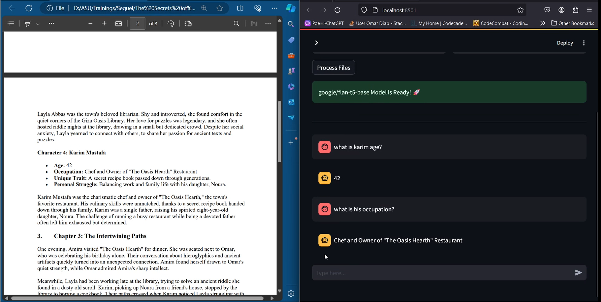

# Private ChatGPT Clone

Using huggingface and langchain this app offers: -

- **Model Switching:** Easily switch between different Huggingface models as per your requirements.
- **Document Chat:** Chat with your documents, including `(CSV, DOCX, PPTX, PDF)` files. Upload your documents and start querying them.

**Chat with your CSV: -**


**Chat with you PDF: -**



**Note:** You need to add an `.env` file with your huggingface api token with `(Permission: write)` or you can just run with your local model but make sure to uncomment the LlamaCpp code block in `get_conversation_chain` and pass your Model path

## Run

```bash
streamlit run Chatgbt_Ghost.py
```

## Models Used

- hkunlp/instructor-xl (For Embeddings)
- google/flan-t5-xxl
- google/flan-t5-small
- google/flan-t5-base
- mistral-7b-instruct-v0.2.Q4_K_S (For local runs using LlamaCpp)

## Some Rules

- Switching models mid conversation **resets** the chat_history (your past questions)

- Files can be embedded as **text_based files** or **CSV files** not both. This resitriction was made to improve Response accuracy.

- Chat history is Disabled with CSV files, As we are only retreiving Data So, To ensure that the retreival is at its best accuracy and not confusing the model with past prompts values.
